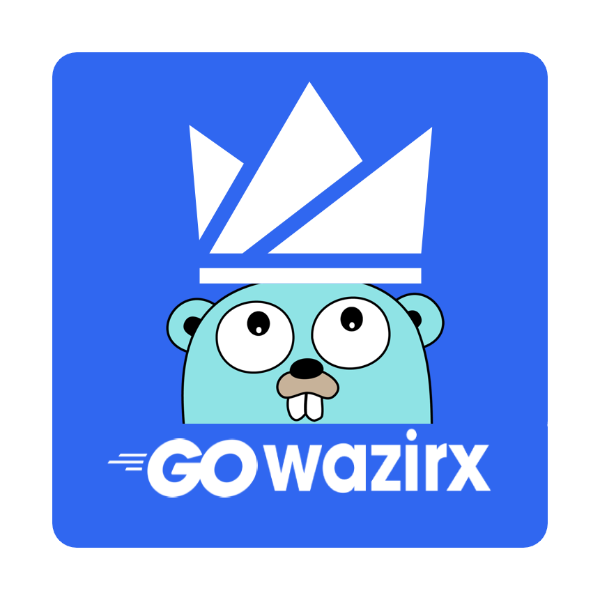

# Go-WazirX
[](https://circleci.com/gh/itsksaurabh/workflows/go-wazirx/tree/master)
[](https://goreportcard.com/report/github.com/itsksaurabh/go-wazirx)
[](https://github.com/itsksaurabh/go-wazirx/blob/master/LICENSE)
___

 

## Go-WazirX is a [Go](http://golang.org/) client library for accessing the [WazirX](https://wazirx.com/)'s Public Rest API.

## API Documentation
You can read the API server documentation [here](https://github.com/WazirX/wazirx-api).

## Usage
Package provides a client for accessing different endpoints of the API.
Create a new instance of Client, then use the various methods on the client to access different parts of the API.

For demonstration:
```
package main

import (
	"context"
	"fmt"
	"log"
	
	"github.com/itsksaurabh/go-wazirx"
)

func main() {
        // client for accessing different endpoints of the API
	client := wazirx.Client{}
	ctx := context.Background()

	data, err := client.MarketStatus(ctx)
	if err != nil {
		log.Fatal("request failed:", err)
	}
	fmt.Println(data)
}

  ```
Notes:
* Using the  [https://godoc.org/context](https://godoc.org/context) package for passing context.
* Look at tests(*_test.go) files for more sample usage.

# Contributing
I welcome pull requests, bug fixes and issue reports. Before proposing a change, please discuss your change by raising an issue.

# Author
<ul>
  <li><a href="https://in.linkedin.com/in/itsksaurabh">Kumar Saurabh</a></li>
</ul>
